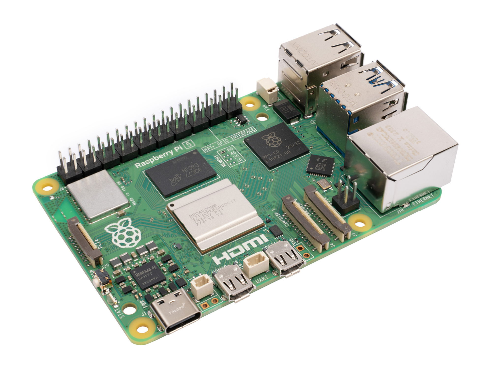
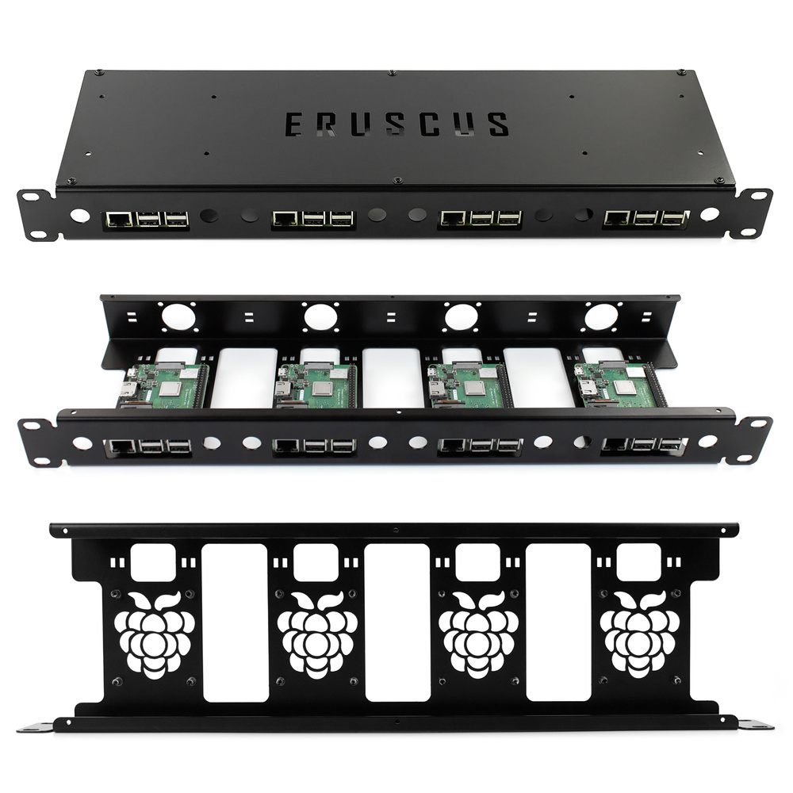
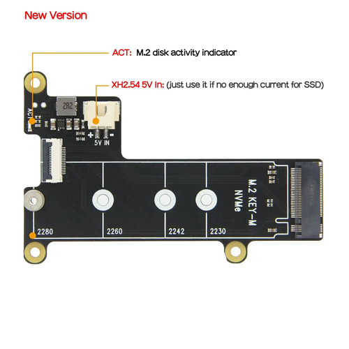
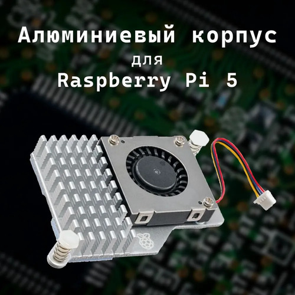
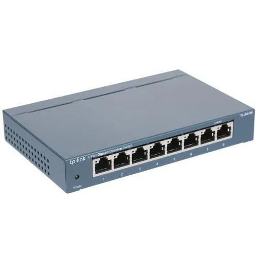
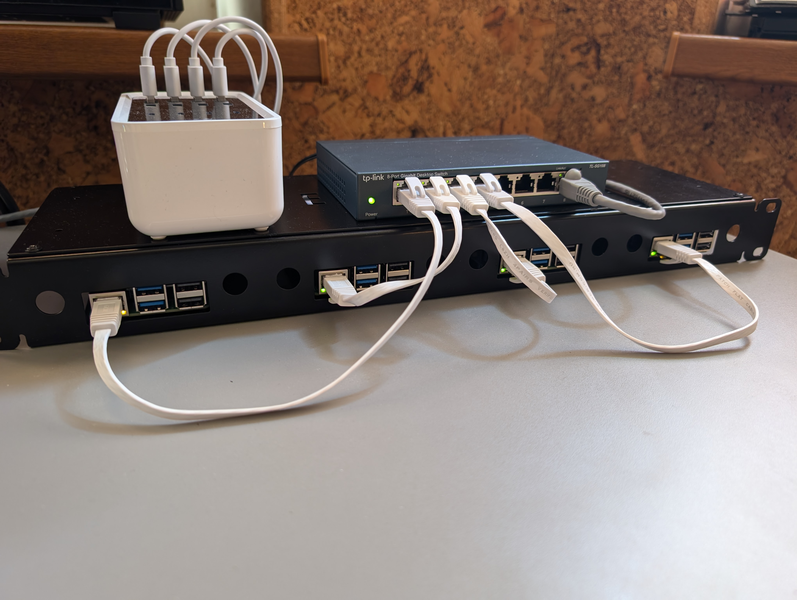

# Specification

| Object | Amount | Image |
| ------------- | ------------- | - |
| Raspberry Pi 5 8GB | 4 |  |
| Rack panel ERUSCUS | 1 |  |
| Gurdini USB HUB 120W | 1 |  |
| Fan 30x30 | 4 |  |
| SmartBuy 128 ГБ | 4 |  |
| Top NVME adapter x1001 | 4 |  |
| Original metal body radiator | 4 |  |
| Cables | 4 |  |
| Patches 0.15 | 3 |  |
| Patches 0.30 | 1 |  |
| TP-Link Switch TL-SG108 | 1 |  |

# Eventual setup



# Cluster setup

[how-to](https://docs.k3s.io/quick-start)

## Master

```bash
curl -sfL https://get.k3s.io | INSTALL_K3S_EXEC='--flannel-backend=none --disable-network-policy' sh -
```

```bash
helml install cilium cilium/cilium --namespace=kube-system --version 1.17.1 --set bpf.masquerade=true --set hubble.relay.enabled=true --set hubble.ui.enabled=true --set kubeProxyReplacement=true
```

If error:
  * add ```cgroup_enable=cpuset cgroup_enable=memory cgroup_memory=1``` to the end of the line in ```/boot/firmware/cmdline.txt```

## Workers

Get token on master ```/var/lib/rancher/k3s/server/node-token```

Run
```bash
curl -sfL https://get.k3s.io | K3S_URL=https://myserver:6443 K3S_TOKEN=mynodetoken sh -
```

## Access

If error while ```kubectl get smth```:

[how-to](https://devops.stackexchange.com/questions/16043/error-error-loading-config-file-etc-rancher-k3s-k3s-yaml-open-etc-rancher)
```bash
export KUBECONFIG=~/.kube/config

mkdir ~/.kube 2> /dev/null
sudo k3s kubectl config view --raw > "$KUBECONFIG"
chmod 600 "$KUBECONFIG"
```

### Access from my machine
```bash
k3s kubectl config view --raw
Copy to local ~/kube/config and change 127.0.0.1 ip
```

## Machines preparation

### Initial setup
Prepare bootable SD Card (can use raspberry tool or just balenaEtcher) with [Raspberry Pi OS Lite 64-bit](https://www.raspberrypi.com/software/operating-systems/) (cause it's just clear Debian 12 you can keep it afterwards)

Than mount it and change:
1. add ```dtparam=nvme``` to config.txt
2. ```HASH=$(openssl passwd -6 -stdin)```</br>
   Type the password, hit enter, then Control + D</br>
   ```echo user:$HASH > userconf.txt```</br>

Now we've prepared SD Card, insert

```sudo rpi-eeprom-config --edit```

Change ```BOOT_ORDER``` to ```BOOT_ORDER=0xf416``` - it's the 6 which represents NVMe boot mode.

Add a line ```PCIE_PROBE=1```

Copy rpi image from other local for ex machine:</br>
```wget 192.169.0.2:8080/rasp.img```</br>
and then</br>
```dd if=./rasp.img of=/dev/nvme0n1```</br>

That's it, then same:
```
mount /dev/nvme0n1p1 /mnt
touch /mnt/ssh
echo "dtparam=nvme" | sudo tee /mnt/config.txt

HASH=$(openssl passwd -6 -stdin)

# Type the password, hit enter, then Control + D

echo user:$HASH > /mnt/userconf.txt
```

Values of booting devices priority: [link](https://community.volumio.com/t/guide-prepare-raspberry-pi-for-boot-from-usb-nvme/65700/2)</br>
In case if the OS was installed on nvme(and bricked for ex as in my case :) ) you should disconnect the disk(cause I just can't boot into the OS to change boot priority) and boot from SD Card or delete ```PCIE_PROBE=1``` and change boot order to ```0xf1``` (restart, SD Card)

The main boot config file is in /boot/firmware/config.txt

[Manual link](https://blog.alexellis.io/booting-the-raspberry-pi-5-from-nvme/)

Disable swap!

### Kernel recompilation

In case you need extra features, for ex BTF, steps:
[Official man](https://www.raspberrypi.com/documentation/computers/linux_kernel.html#building)

A pair of moments:
1. If you don't see BTF feature in menuconfig: [link](https://medium.com/@oayirnil/three-ways-to-experiment-ebpf-on-raspberry-pi-bcc-python-libbpf-rs-rust-aya-rust-c9edfb373eda)
2. If libelf not found -> apt install libelf-dev
3. apt install dwarves

# Updates

## Full prepare raspberry as k8s node, updated version

### 1. build_kernel_btf.sh - run on each Pi
```bash
#!/bin/bash
set -e

echo "=== Installing dependencies ==="
sudo apt update
sudo apt install -y git bc bison flex libssl-dev make libncurses-dev libelf-dev dwarves pahole tmux

echo "=== Cloning kernel source ==="
cd ~
git clone --depth=1 --branch rpi-6.12.y https://github.com/raspberrypi/linux
cd linux

echo "=== Applying default config for Pi 5 ==="
KERNEL=kernel_2712
make bcm2712_defconfig

echo "=== Enabling BTF ==="
sed -i 's/CONFIG_DEBUG_INFO_DISABLED=y/# CONFIG_DEBUG_INFO_DISABLED is not set/' .config
echo "CONFIG_DEBUG_INFO=y" >> .config
echo "# CONFIG_DEBUG_INFO_NONE is not set" >> .config
echo "CONFIG_DEBUG_INFO_DWARF4=y" >> .config
echo "CONFIG_DEBUG_INFO_COMPRESSED_NONE=y" >> .config
echo "CONFIG_DEBUG_INFO_BTF=y" >> .config
echo "CONFIG_DEBUG_INFO_BTF_MODULES=y" >> .config

echo "=== Verifying BTF config ==="
grep CONFIG_DEBUG_INFO_BTF .config

echo "=== Compiling kernel (~1-2 hours) ==="
make -j$(nproc) Image.gz modules dtbs

echo "=== Installing modules ==="
sudo make -j$(nproc) modules_install

echo "=== Copying kernel to boot partition ==="
sudo cp /boot/firmware/$KERNEL.img /boot/firmware/$KERNEL.img.bak
sudo cp arch/arm64/boot/Image.gz /boot/firmware/$KERNEL.img
sudo cp arch/arm64/boot/dts/broadcom/*.dtb /boot/firmware/
sudo cp arch/arm64/boot/dts/overlays/*.dtb* /boot/firmware/overlays/
sudo cp arch/arm64/boot/dts/overlays/README /boot/firmware/overlays/

echo "=== Enabling cgroup memory ==="
sudo sed -i 's/$/ cgroup_enable=cpuset cgroup_enable=memory cgroup_memory=1/' /boot/firmware/cmdline.txt

echo "=== Done! Rebooting ==="
sudo reboot
```

### 2. Verify
```bash
uname -r && ls /sys/kernel/btf/vmlinux && echo "BTF is working!"
```

### 3. Prepare node for k8s
prepare_k8s_node.sh - run after reboot with new kernel:
```bash
#!/bin/bash
set -e

echo "=== Disabling swap (zram) permanently ==="
sudo systemctl disable --now systemd-zram-setup@zram0.service
sudo systemctl mask systemd-zram-setup@zram0.service
sudo systemctl disable --now rpi-zram-writeback.timer
sudo systemctl mask dev-zram0.swap
sudo swapoff -a
sudo sed -i '/ swap / s/^/#/' /etc/fstab

echo "=== Verifying swap is off ==="
free -h | grep Swap

echo "=== Loading required kernel modules ==="
cat <<EOF | sudo tee /etc/modules-load.d/k8s.conf
overlay
br_netfilter
EOF
sudo modprobe overlay
sudo modprobe br_netfilter

echo "=== Configuring sysctl for k8s networking ==="
cat <<EOF | sudo tee /etc/sysctl.d/k8s.conf
net.bridge.bridge-nf-call-iptables  = 1
net.bridge.bridge-nf-call-ip6tables = 1
net.ipv4.ip_forward                 = 1
EOF
sudo sysctl --system

echo "=== Installing containerd ==="
sudo apt install -y containerd
sudo mkdir -p /etc/containerd
containerd config default | sudo tee /etc/containerd/config.toml
sudo sed -i 's/SystemdCgroup = false/SystemdCgroup = true/' /etc/containerd/config.toml
sudo systemctl restart containerd
sudo systemctl enable containerd

echo "=== Installing kubeadm kubelet kubectl ==="
sudo apt install -y apt-transport-https ca-certificates curl gpg
curl -fsSL https://pkgs.k8s.io/core:/stable:/v1.35/deb/Release.key | sudo gpg --dearmor -o /etc/apt/keyrings/kubernetes-apt-keyring.gpg
echo 'deb [signed-by=/etc/apt/keyrings/kubernetes-apt-keyring.gpg] https://pkgs.k8s.io/core:/stable:/v1.35/deb/ /' | sudo tee /etc/apt/sources.list.d/kubernetes.list
# or in local case
# echo 'deb [signed-by=/etc/apt/keyrings/kubernetes-apt-keyring.gpg trusted=yes] http://10.10.10.73:8093/repository/k8s-v1.35-proxy/ /' | sudo tee /etc/apt/sources.list.d/kubernetes.list
sudo apt update
sudo apt install -y kubelet kubeadm kubectl
sudo apt-mark hold kubelet kubeadm kubectl
sudo systemctl enable kubelet

echo "=== Node is ready to join the cluster ==="
```

### 3. `kubeadm token create --print-join-command`

### 4. On each Pi
```bash
sudo kubeadm reset -f
sudo rm -rf /etc/kubernetes /var/lib/kubelet /var/lib/etcd
sudo systemctl restart containerd

# Paste the join command from master here
sudo kubeadm join <MASTER_IP>:6443 --token <TOKEN> --discovery-token-ca-cert-hash sha256:<HASH>
```