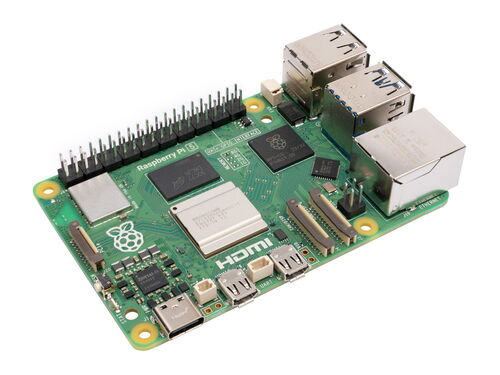
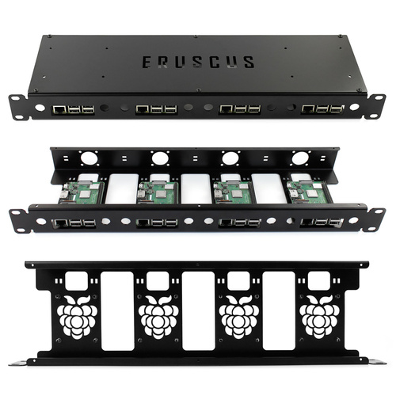

# Specification

| Object | Amount | Image | Link |
| ------------- | ------------- | - | - |
| Raspberry Pi 5 8GB | 4 |  |
| Rack panel ERUSCUS | 1 |  |
| Gurdini USB HUB 120W | 1 |  |
| Fan 30x30 | 4 |  |
| SmartBuy 128 ГБ | 4 |  |
| Top NVME adapter x1001 | 4 |  |
| Original metal body radiator | 4 |  |
| Cables | 4 |  |

# Cluster setup

[how-to](https://docs.k3s.io/quick-start)

## Master

```bash
curl -sfL https://get.k3s.io | sh -
```

If error:
  * add ```cgroup_enable=cpuset cgroup_enable=memory cgroup_memory=1``` to the end of the line in ```/boot/firmware/cmdline.txt```

## Workers

Get token on master ```/var/lib/rancher/k3s/server/node-token```

Run
```bash
curl -sfL https://get.k3s.io | K3S_URL=https://myserver:6443 K3S_TOKEN=mynodetoken sh -
```

## Access

If error while ```kubectl get smth```:
(how-to)[https://devops.stackexchange.com/questions/16043/error-error-loading-config-file-etc-rancher-k3s-k3s-yaml-open-etc-rancher]
```bash
export KUBECONFIG=~/.kube/config

mkdir ~/.kube 2> /dev/null
sudo k3s kubectl config view --raw > "$KUBECONFIG"
chmod 600 "$KUBECONFIG"
```

### Access from my machine
```bash
k3s kubectl config view --raw
Copy to local ~/kube/config and change 127.0.0.1 ip
```
