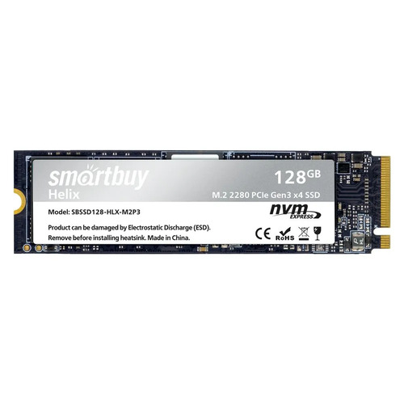
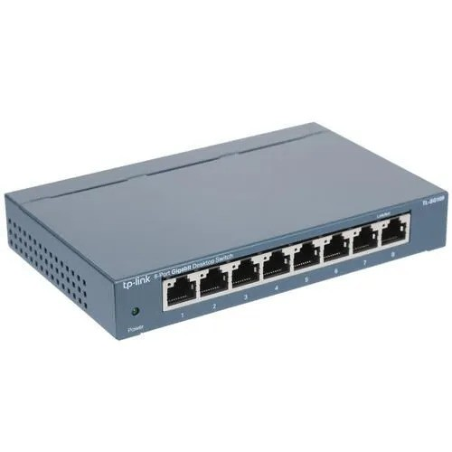

# Specification

| Object | Amount | Image |
| ------------- | ------------- | - |
| Raspberry Pi 5 8GB | 4 |  |
| Rack panel ERUSCUS | 1 |  |
| Gurdini USB HUB 120W | 1 |  |
| Fan 30x30 | 4 |  |
| SmartBuy 128 ГБ | 4 |  |
| Top NVME adapter x1001 | 4 |  |
| Original metal body radiator | 4 |  |
| Cables | 4 |  |
| Patches 0.15 | 3 |  |
| Patches 0.30 | 1 |  |
| TP-Link Switch TL-SG108 | 1 |  |

# Eventual setup


# Cluster setup

[how-to](https://docs.k3s.io/quick-start)

## Master

```bash
curl -sfL https://get.k3s.io | sh -
```

If error:
  * add ```cgroup_enable=cpuset cgroup_enable=memory cgroup_memory=1``` to the end of the line in ```/boot/firmware/cmdline.txt```

## Workers

Get token on master ```/var/lib/rancher/k3s/server/node-token```

Run
```bash
curl -sfL https://get.k3s.io | K3S_URL=https://myserver:6443 K3S_TOKEN=mynodetoken sh -
```

## Access

If error while ```kubectl get smth```:

[how-to](https://devops.stackexchange.com/questions/16043/error-error-loading-config-file-etc-rancher-k3s-k3s-yaml-open-etc-rancher)
```bash
export KUBECONFIG=~/.kube/config

mkdir ~/.kube 2> /dev/null
sudo k3s kubectl config view --raw > "$KUBECONFIG"
chmod 600 "$KUBECONFIG"
```

### Access from my machine
```bash
k3s kubectl config view --raw
Copy to local ~/kube/config and change 127.0.0.1 ip
```

## Machines preparation

### Initial setup
Prepare bootable SD Card (can use raspberry tool or just balenaEtcher) with [Raspberry Pi OS Lite 64-bit](https://www.raspberrypi.com/software/operating-systems/) (cause it's just clear Debian 12 you can keep it afterwards)

Than mount it and change:
1. add ```dtparam=nvme``` to config.txt
2. ```HASH=$(openssl passwd -6 -stdin)```</br>
   Type the password, hit enter, then Control + D</br>
   ```echo user:$HASH > userconf.txt```</br>

Now we've prepared SD Card, insert

```sudo rpi-eeprom-config --edit```

Change ```BOOT_ORDER``` to ```BOOT_ORDER=0xf416``` - it's the 6 which represents NVMe boot mode.

Add a line ```PCIE_PROBE=1```

Copy rpi image from other local for ex machine:</br>
```wget 192.169.0.2:8080/rasp.img```</br>
and then</br>
```dd if=./rasp.img of=/dev/nvme0n1```</br>

That's it, then same:
```
mount /dev/nvme0n1p1 /mnt
touch /mnt/ssh
echo "dtparam=nvme" | sudo tee /mnt/config.txt

HASH=$(openssl passwd -6 -stdin)

# Type the password, hit enter, then Control + D

echo user:$HASH > /mnt/userconf.txt
```

Values of booting devices priority: [link](https://community.volumio.com/t/guide-prepare-raspberry-pi-for-boot-from-usb-nvme/65700/2)</br>
In case if the OS was installed on nvme(and bricked for ex as in my case :) ) you should disconnect the disk(cause I just can't boot into the OS to change boot priority) and boot from SD Card or delete ```PCIE_PROBE=1``` and change boot order to ```0xf1``` (restart, SD Card)

The main boot config file is in /boot/firmware/config.txt

[Manual link](https://blog.alexellis.io/booting-the-raspberry-pi-5-from-nvme/)

Disable swap!

### Kernel recompilation

In case you need extra features, for ex BTF, steps:
[Official man](https://www.raspberrypi.com/documentation/computers/linux_kernel.html#building)

A pair of moments:
1. If you don't see BTF feature in menuconfig: [link](https://medium.com/@oayirnil/three-ways-to-experiment-ebpf-on-raspberry-pi-bcc-python-libbpf-rs-rust-aya-rust-c9edfb373eda)
2. If libelf not found -> apt install libelf-dev
3. apt install dwarves
